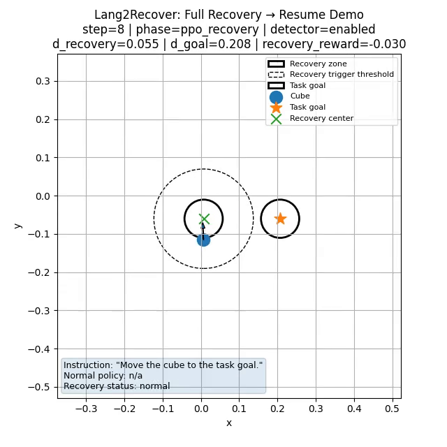
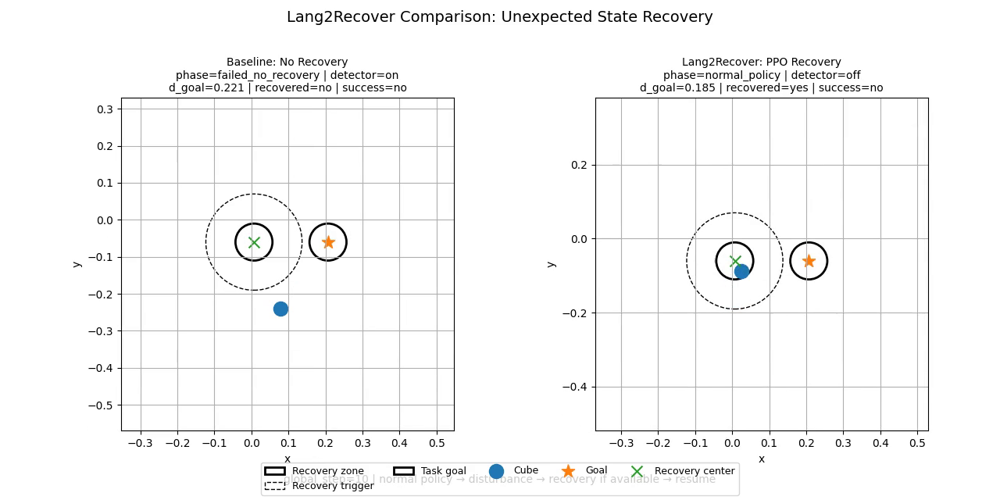

# Lang2Recover

**Language-guided RL recovery for VLA robot control.**

Lang2Recover is a small Physical AI project exploring how a robot system can recover from unexpected states during task execution. The core idea is:

```text
normal policy executes task
unexpected perturbation knocks system out of distribution
recovery detector triggers
PPO recovery policy restores a known-good state
normal policy resumes and completes the task
```

The project uses **ManiSkill** as the simulation backend, a lightweight **PPO recovery policy**, and a **language-generated reward specification** inspired by Text2Reward/Eureka-style reward generation.

---

## Motivation

Vision-Language-Action models and language-conditioned robot policies are often strong within the state distribution they were trained on, but they may fail when the world enters an unexpected state, for example when

- the object is knocked away,
- a grasp fails,
- the robot reaches an unfamiliar configuration,
- the scene leaves the normal policy's expected operating region.

Instead of expecting the main policy to handle every failure end-to-end, Lang2Recover separates the system into:

```text
task execution policy
+ failure detector
+ learned recovery policy
+ language-shaped recovery reward
```

The recovery policy is restoring the system to a **known-good recovery state** where the normal task policy can continue (it does not solve the task).

---

## Current MVP

The current MVP demonstrates this idea on a cube manipulation abstraction.

```text
Task:
  Move the cube to the task goal.

Unexpected state:
  An artificial disturbance knocks the cube away.

Recovery goal:
  Bring the cube back to the recovery zone.

Resume:
  Continue moving the cube to the task goal.
```

The current implementation is lightweight:

- ManiSkill is used as the simulation/state container.
- The normal policy is a cube-level placeholder policy.
- The recovery policy is trained with PPO in a cheap 2D recovery environment.
- The recovery reward is generated from a natural-language reward specification.
- The final demo is rendered as top-down videos from simulator state logs.

---

## Demo

The cube is moved toward the task goal, knocked away by an artificial perturbation, recovered by the PPO recovery policy, and then the normal policy resumes.



### Recovery comparison

Left: no recovery baseline.  
Right: Lang2Recover with PPO recovery.



## Architecture

```text
1. Natural-language task instruction
       
2. Normal task policy
     
3. ManiSkill scene state
        
4. Recovery detector
        
5. if unexpected state detected:
        
6. PPO recovery policy
    
7. known-good recovery state
        
8. Normal task policy resumes
        
9. task success
```

The reward-generation pipeline is:

```text
1. reward_specs/cube_recovery.yaml
        
2. scripts/07_generate_language_reward.py
        
3. generated_rewards/cube_recovery_prompt.txt

4. generated_rewards/cube_recovery_language_reward.py
        
5. PPO training
```

`reward_specs/` is source-controlled.  
`generated_rewards/` is generated output and is ignored by Git.

---

## Repository structure

```text
lang2recover/
│
├── README.md
├── pyproject.toml
├── .gitignore
│
├── reward_specs/
│   └── cube_recovery.yaml
│
├── scripts/
│   ├── 01_smoke_test_pushcube.py
│   ├── 02_knock_and_detect.py
│   ├── 03_scripted_recovery_demo.py
│   ├── 04_train_recovery_ppo.py
│   ├── 05_evaluate_recovery_policy.py
│   ├── 06_integrated_ppo_recovery_demo.py
│   ├── 07_generate_language_reward.py
│   ├── 08_full_pipeline_resume_demo.py
│   ├── 09_evaluate_recovery_strategies.py
│   └── 10_make_strategy_comparison_video.py
│
└── src/
    └── lang2recover/
        ├── envs/
        │   └── recovery_2d_env.py
        │
        ├── evaluation/
        │   └── __init__.py
        │
        ├── policies/
        │   └── cube_level_normal_policy.py
        │
        ├── recovery/
        │   ├── detector.py
        │   |── perturbations.py
        │   └── ppo_adapter.py
        │
        ├── rewards/
        │   |── generated_recovery_reward.py
        │   └── language_reward_codegen.py
        │
        └── sim/
            └── maniskill_pushcube.py
```

---

## Setup

The following commands assume Git Bash on Windows.

```bash
python -m venv .venv
source .venv/Scripts/activate
python -m pip install --upgrade pip setuptools wheel
python -m pip install -e .
```

---

## Run the milestones

### 1. Smoke test ManiSkill

```bash
python scripts/01_smoke_test_pushcube.py
```

This checks that ManiSkill runs without requiring video rendering.

---

### 2. Knock-away perturbation and recovery detector

```bash
python scripts/02_knock_and_detect.py
```

Expected behavior:

```text
cube starts in recovery zone, artificial perturbation knocks cube away, detector triggers needs_recovery
```

Output video:

```text
videos/02_knock_and_detect_topdown/knock_and_detect_topdown.mp4
```

---

### 3. Scripted recovery baseline

```bash
python scripts/03_scripted_recovery_demo.py
```

Expected behavior:

```text
cube gets knocked away, scripted placeholder recovery moves it back, system returns to recovered state
```

Output video:

```text
videos/03_scripted_recovery_demo/scripted_recovery_demo.mp4
```

---

### 4. Train PPO recovery policy

```bash
python scripts/04_train_recovery_ppo.py --reward-mode manual_dense --timesteps 50000
```

---

### 5. Evaluate PPO recovery policy

```bash
python scripts/05_evaluate_recovery_policy.py --reward-mode manual_dense
```

Expected behavior:

```text
displaced cube, PPO policy moves it back to recovery zone, recovered=True
```

Output video:

```text
videos/05_ppo_recovery_policy/manual_dense/ppo_recovery_policy.mp4
```

---

### 6. Integrated PPO recovery demo

```bash
python scripts/06_integrated_ppo_recovery_demo.py
```

Expected behavior:

```text
normal placeholder, artificial disturbance, PPO recovery, recovered state
```

Output video:

```text
videos/06_integrated_ppo_recovery_demo/integrated_ppo_recovery_demo.mp4
```

---

### 7. Generate language-shaped reward

```bash
python scripts/07_generate_language_reward.py
```

This reads:

```text
reward_specs/cube_recovery.yaml
```

and generates:

```text
generated_rewards/cube_recovery_prompt.txt
generated_rewards/cube_recovery_language_reward.py
```

The generated reward objective is:

```text
Move the displaced cube back into the known-good recovery zone.
The reward should encourage progress toward the recovery zone, penalize
unnecessary action magnitude, give a success bonus when the cube is recovered,
and penalize moving the cube outside the workspace.
```

---

### 8. Train PPO with language-generated reward

```bash
python scripts/04_train_recovery_ppo.py --reward-mode language_generated --timesteps 50000
```

Evaluate:

```bash
python scripts/05_evaluate_recovery_policy.py --reward-mode language_generated
```

---

### 9. Full recovery
```bash
python scripts/08_full_pipeline_resume_demo.py --reward-mode language_generated --knock-step 4
```

Expected behavior:

```text
normal policy starts moving cube toward goal, cube gets knocked away, PPO recovery policy restores cube to recovery zone, normal policy resumes, cube reaches task goal
```

Expected final output:

```text
Recovered at least once: True
Task success: True
```

Output video:

```text
videos/08_full_pipeline_resume_demo/language_generated/full_pipeline_recovery_resume_demo.mp4
```

---

### 10. Quantitative evaluation

```bash
python scripts/09_evaluate_recovery_strategies.py --episodes 30 --reward-mode language_generated
```

This compares:

```text
no_recovery
scripted_recovery
ppo_recovery
```

Outputs:

```text
results/evaluation/recovery_strategy_results.csv
results/evaluation/recovery_strategy_summary.csv
results/evaluation/success_rate_by_strategy.png
results/evaluation/mean_steps_by_strategy.png
```

Expected high-level result:

```text
no_recovery: low or zero task success
scripted_recovery: high task success
ppo_recovery: high task success
```

---

### 11. Side-by-side comparison

```bash
python scripts/10_make_strategy_comparison_video.py --reward-mode language_generated --knock-step 4
```

```text
left: no recovery baseline
right: PPO recovery system
```

Output video:

```text
videos/10_strategy_comparison/language_generated/no_recovery_vs_ppo_recovery.mp4
```

Expected final output:

```text
no_recovery | recovered=False | success=False
ppo_recovery | recovered=True | success=True
```

---
